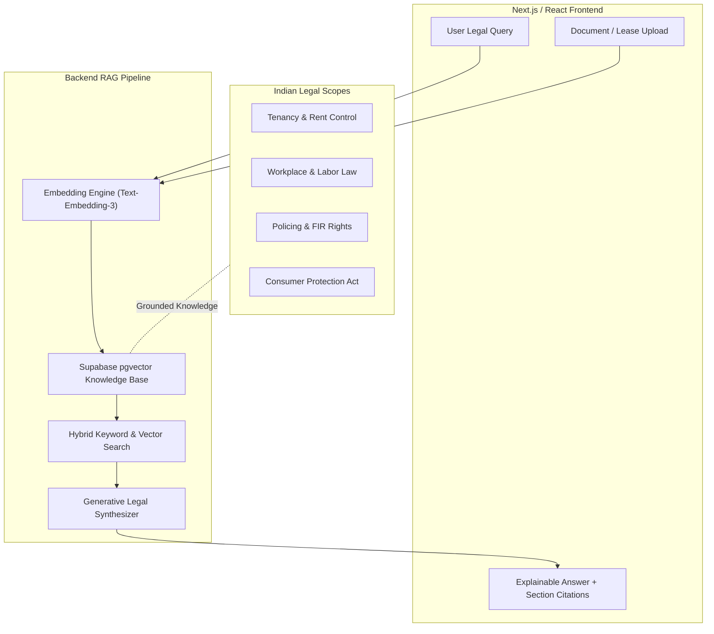

# ⚖️ Sahur AI (ZeroX) — RAG Legal Compliance Assistant

**An AI-Powered Legal Literacy & Compliance System Scoped to Indian Jurisdictions** — delivering RAG-grounded legal guidance across tenancy, workplace rights, police interaction, and consumer protection.

[](https://typescriptlang.org)
[](https://python.org)
[](https://supabase.com)
[](https://fastapi.tiangolo.com)

---

## 🏛️ Project Vision & Architecture

Generic conversational LLMs often output hallucinated legal advice or out-of-jurisdiction case law. **Sahur AI** addresses this challenge through strict Retrieval-Augmented Generation (RAG):



---

## 🔑 Core Features

1. **Scoped Domain Expertise**: Dedicated knowledge bases covering:
   - **Tenancy & Housing**: Eviction laws, deposit refunds, rent agreement clauses.
   - **Workplace Rights**: Labor codes, notice periods, wrongful termination, POSH compliance.
   - **Police & Citizen Rights**: FIR filing procedures, bail rights, zero FIR, detention protocol.
   - **Consumer Protection**: E-commerce refunds, defective product claims under CPA 2019.
2. **Document & Contract Parsing**: Upload lease agreements or contracts to flag high-risk or predatory clauses.
3. **Verifiable Citations**: Every response references specific Indian Penal Code (IPC), Bharatiya Nyaya Sanhita (BNS), or statutory section numbers.

---

## 🛠️ Tech Stack

- **Frontend**: Next.js, React, Tailwind CSS, TypeScript
- **Backend API**: Python, FastAPI / Node.js Express
- **Vector Database & Auth**: Supabase, PostgreSQL, `pgvector`
- **Embeddings & LLM**: OpenAI / Gemini RAG pipeline

---

## 🚀 Setup & Local Execution

### Prerequisites
- Node.js 18+ & Python 3.11+
- Supabase account with `pgvector` enabled

### 1. Backend Setup
```bash
cd backend
python -m venv venv
source venv/bin/activate  # Or venv\Scripts\activate on Windows
pip install -r requirements.txt
uvicorn main:app --reload
```

### 2. Frontend Setup
```bash
cd frontend
npm install
npm run dev
```

---

<div align="center">
  <sub>Maintained by <a href="https://github.com/NINJA981">NINJA981</a></sub>
</div>
